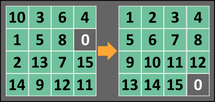

# [Sliding Puzzle Solver](https://www.codewars.com/kata/sliding-puzzle-solver/)
### Overview

A sliding puzzle is a combination puzzle that challenges a player to slide (frequently flat) pieces along certain routes (usually on a board) to establish a certain end-configuration.

Your goal for this kata is to write a function that produces a sequence of tile movements that solves the puzzle.


### Input
An n x n array/list comprised of integer values ranging from 0 to n^2 - 1 (inclusive), which represents a square grid of tiles. Note that there will always be one empty tile (represented by 0) to allow for movement of adjacent tiles.

### Output
An array/list comprised of any (but not necessarily all) of the integers from 1 to n^2 - 1, inclusive. This represents the sequence of tile moves for a successful transition from the initial unsolved state to the solved state. If the puzzle is unsolvable, return null(JavaScript) or None(Python).

### Test Example
Given:
```
simple_example = [
    [ 1, 2, 3, 4],
    [ 5, 0, 6, 8],
    [ 9,10, 7,11],
    [13,14,15,12]
]
slide_puzzle(simple_example) #[6,7,11,12]
```
Transition sequence:
```
[ 1, 2, 3, 4]    [ 1, 2, 3, 4]    [ 1, 2, 3, 4]    [ 1, 2, 3, 4]    [ 1, 2, 3, 4] 
[ 5, 0, 6, 8]    [ 5, 6, 0, 8]    [ 5, 6, 7, 8]    [ 5, 6, 7, 8]    [ 5, 6, 7, 8] 
[ 9,10, 7,11] -> [ 9,10, 7,11] -> [ 9,10, 0,11] -> [ 9,10,11, 0] -> [ 9,10,11,12]
[13,14,15,12]    [13,14,15,12]    [13,14,15,12]    [13,14,15,12]    [13,14,15, 0] 
```
Any valid transition sequence will be treated as correct.
### Solutions

#### NaiveSolver

NaiveSolver is a non-optimized solver, that uses a breadth first search to brute force a solution. It avoids some backtracking by preventing opposite moves from being made one after another, and it avoids infinite loops (at least in V2) by taking a non-recursive approach.

NaiveSolver is only able to solve small puzzles, while the problem in questions asks for grids of up to 10X10. Potential solutions include an optimized variant of A* Search. Or, to avoid brute force, a Genetic Algorithm.

#### SimpleGA

SimpleGA applies a Genetic Algorithm to the problem. The results are promising for the current version, however the solver is subject to a local maxima (where the top row/s get solved leaving the bottom row\s with no room to maneuver). With a peak fitness of 4 on a 3X3 puzzle it means that the final row (and most of the second one) is too little space to navigate in.

To resolve the local maxima issue with SimpleGA I have 2 proposed solutions:
 - Add a more flexible fitness function (the current one only scores pieces in the final position, and only until it finds a mistake).
 - See how larger grids behave regarding maxima, and turn the solution into a hybrid where the GA does an initial search leaving more traditional techniques to finish up whatever remains.